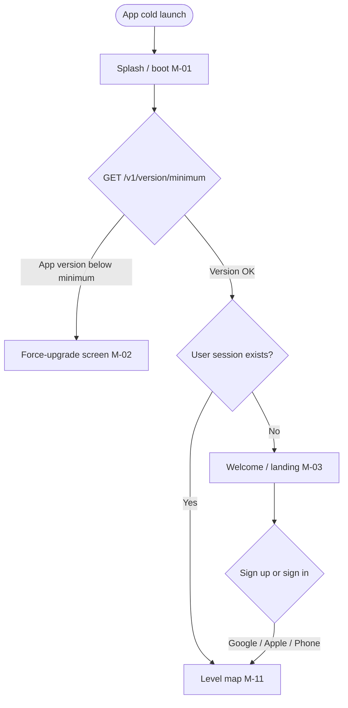
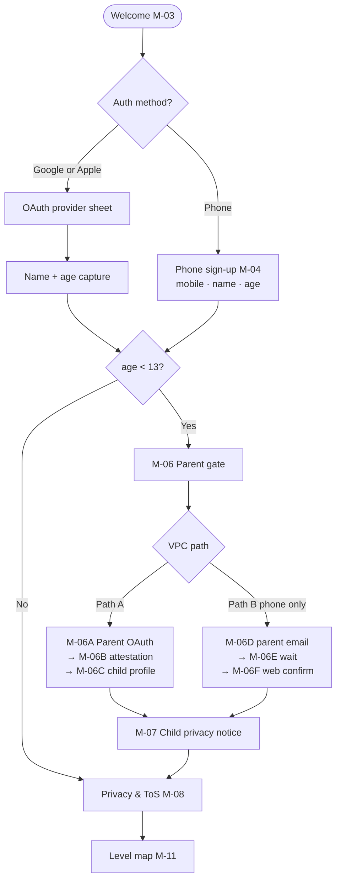
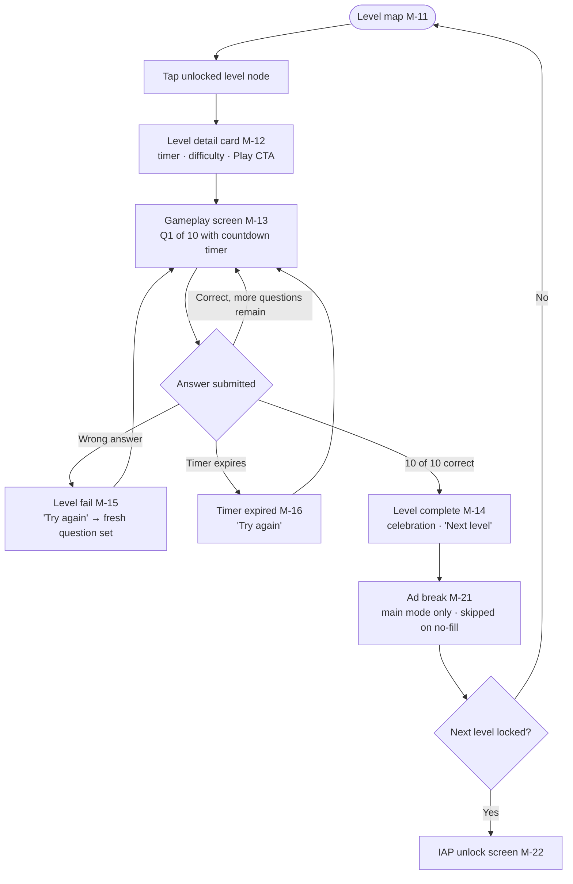
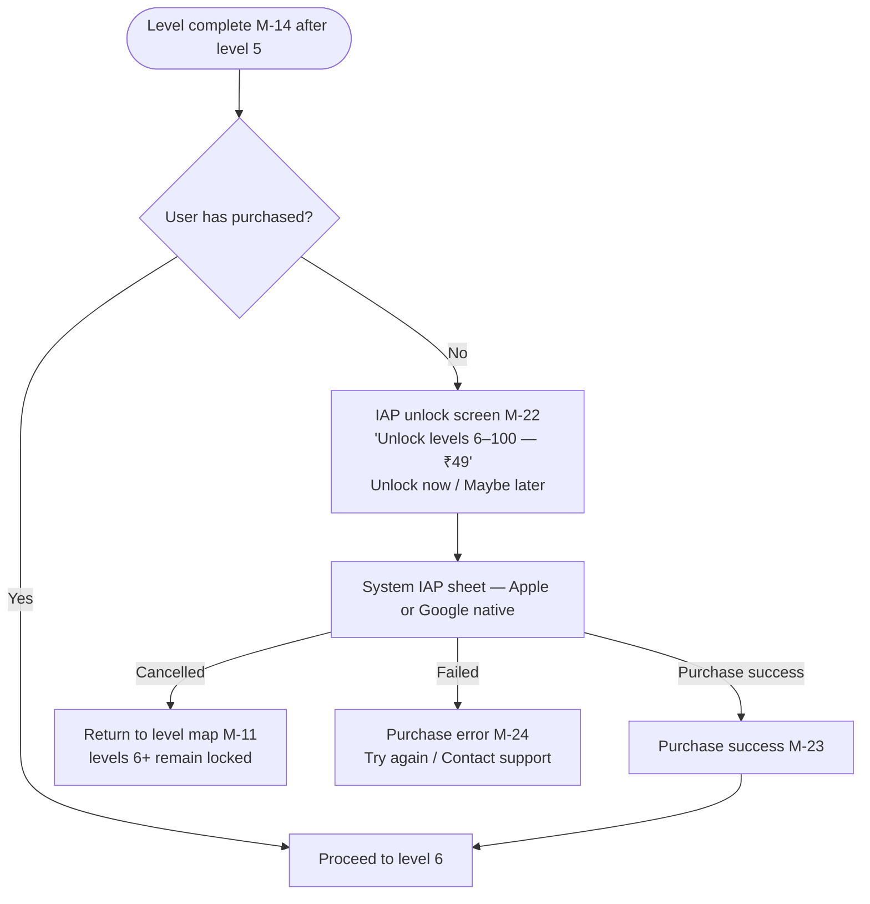
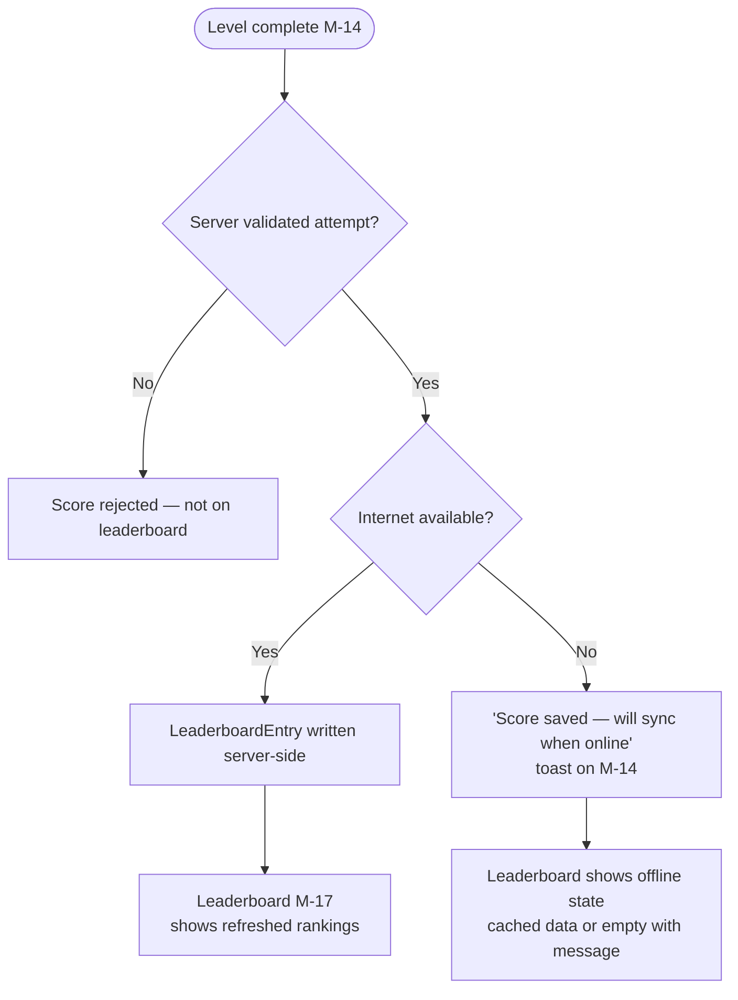
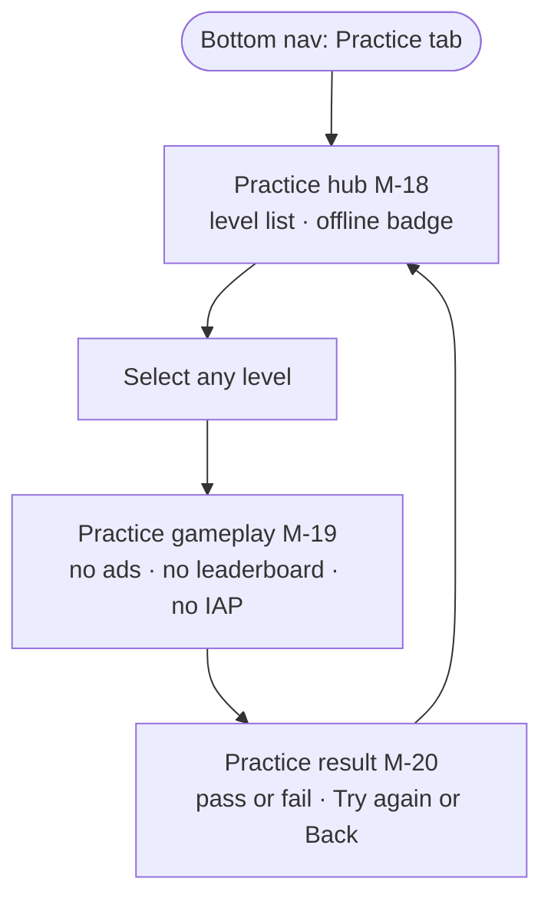
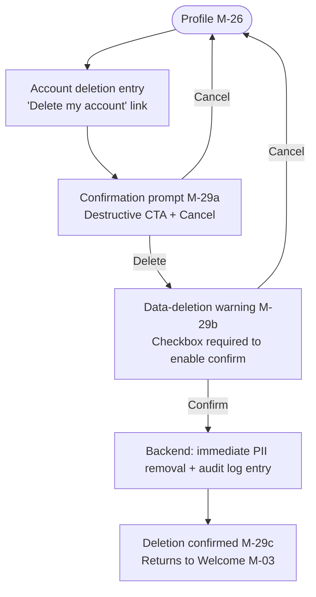
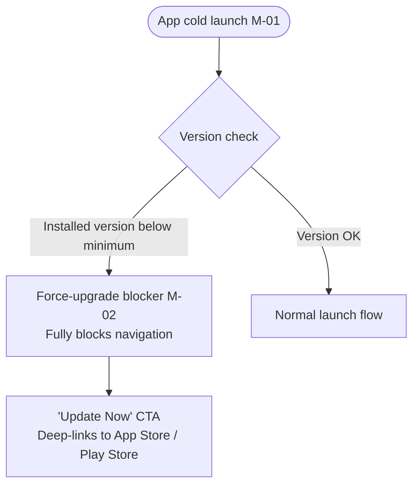

# Anointed — UI/UX Design Specification

**Generated by:** UX Design Agent  
**Source documents:** `requirements.json`, `architecture.html`  
**Date:** 1 Sep 2026  
**Platform:** Flutter mobile (iOS 15+ / Android 8.0+, phones & tablets) + Web Admin Dashboard

> **Compliance note:** This app collects data from children under 13. Screens marked 🛡 are included specifically because of COPPA/DPDPA obligations. All compliance-related design decisions must be reviewed by legal counsel before App Store / Play Store submission.

---

## Table of Contents

1. [Screen Inventory — Mobile App](#1-screen-inventory--mobile-app)
2. [Screen Inventory — Web Admin Dashboard](#2-screen-inventory--web-admin-dashboard)
3. [Onboarding Sequence](#3-onboarding-sequence)
4. [Permission-Request Screens](#4-permission-request-screens)
5. [Push Notification Opt-in](#5-push-notification-opt-in)
6. [Key User Flows](#6-key-user-flows)
7. [Design Tokens](#7-design-tokens)
8. [Accessibility Notes](#8-accessibility-notes)
9. [Account Management Screens](#9-account-management-screens)
10. [Authentication — Phone, Google & Apple (v1)](#10-authentication--phone-google--apple-v1)
11. [Parental Consent & Verifiable Parental Consent (VPC)](#11-parental-consent--verifiable-parental-consent-vpc)
12. [Dark Mode and Tablet / Landscape](#12-dark-mode-and-tablet--landscape)
13. [Localization Impact](#13-localization-impact)
14. [Support & Feedback Entry Point](#14-support--feedback-entry-point)
15. [Empty, Loading, and Error States](#15-empty-loading-and-error-states)
16. [Force-Upgrade Screen](#16-force-upgrade-screen)
17. [Inferred Assumptions & Open UX Questions](#17-inferred-assumptions--open-ux-questions)
18. [Content Schema & Authoring Workflow](#18-content-schema--authoring-workflow)
19. [Practice Content Cache & Version Sync](#19-practice-content-cache--version-sync)
20. [Monetization Strategy (v1)](#20-monetization-strategy-v1)
21. [Leaderboard Integrity & Anti-Cheat](#21-leaderboard-integrity--anti-cheat)
22. [Local Notifications (v1)](#22-local-notifications-v1)
23. [Admin Dashboard — AdminJS (v1)](#23-admin-dashboard--adminjs-v1)
24. [Localization Infrastructure](#24-localization-infrastructure)

---

## 1. Screen Inventory — Mobile App

Screens are grouped by flow zone. There is a single end-user role (player); the admin role lives in the web dashboard (see §2). Age groups (kid / youth / adult / elder) share the same screen structure — age-specific differences are noted inline.

### 1A. Launch & Version Check

| # | Screen | Notes |
|---|--------|-------|
| M-01 | **Splash / Boot** | App logo and name; shown while version-check API call completes. Routes to M-02 (force upgrade) or M-03 (welcome). |
| M-02 | **Force-upgrade blocker** | Full-screen blocking prompt. See §15. |

### 1B. Authentication & Onboarding

| # | Screen | Notes |
|---|--------|-------|
| M-03 | **Welcome / Landing** | App hero visual, tagline. **Primary CTAs (equal prominence):** "Continue with Google", "Continue with Apple" (iOS only), and "Continue with phone number." Secondary link: "Already have an account? Sign in." Low-friction auth for kids/youth — no SMS OTP, no biometric, no email/password. |
| M-04 | **Phone sign-up form** | Shown when user chooses phone path. Three fields: mobile number, display name, age. No OTP verification. After submit → age routing (M-05). |
| M-05 🛡 | **Age gate (routing logic)** | Silent routing after profile capture. Age < 13 → **Parental VPC flow (M-06 series)** — account stays `pending_parental_consent` until verified. Age ≥ 13 → M-08. |
| M-06 🛡 | **Parent gate** | Full-screen block: *"Ask a parent or guardian to continue."* Child cannot proceed alone. Explains that an adult must verify consent before the account is created. Two VPC paths offered: **Path A (recommended): Parent Google/Apple sign-in** · **Path B: Parent email verification** (required for phone-path under-13). |
| M-06A 🛡 | **VPC Path A — Parent OAuth** | Parent taps "Continue as parent with Google" or "Continue as parent with Apple." Uses a **separate OAuth flow from the child's** (account picker must allow switching accounts). Backend records `parent_oauth_provider`, `parent_oauth_sub`, and verified adult email from token. |
| M-06B 🛡 | **VPC Path A — Parent attestation & consent** | Parent-only form (after M-06A): guardian legal name (required), checkbox *"I am the parent or legal guardian of this child"*, checkbox *"I consent to the collection and use of my child's information as described in the Privacy Policy"* (link opens in-app browser), dropdown *relationship* (parent / guardian / other legal guardian). Submit creates `ParentalConsentRecord` with `method = oauth_parent_attestation`. |
| M-06C 🛡 | **Child profile setup (parent completes)** | Parent enters **child's display name** (pre-filled if captured earlier). Optional: child's mobile number for account linking. Confirms age shown from earlier step (read-only). Submit activates child account → M-07. |
| M-06D 🛡 | **VPC Path B — Parent email entry** | Shown when under-13 user chose **phone path** (Path A still available as alternative). Parent enters **their email address** (not the child's). Backend sends verification email with signed token link (72-hour expiry). Child/account remains blocked until verified. |
| M-06E 🛡 | **VPC Path B — Awaiting email verification** | Waiting screen: *"We sent a link to [parent@email.com]. A parent must tap the link to continue."* Polls `GET /v1/consent/status` every 5s. "Resend email" (60s cooldown). "Use Google/Apple instead" → M-06A. Cannot skip. |
| M-06F 🛡 | **VPC Path B — Parent email confirmation (web)** | **Web page** (not in-app): opened when parent clicks email link. Shows child privacy notice, data collected, consent language. Parent enters guardian name, checks consent box, submits. Redirect/deep-link returns app to M-07 or shows success + "Return to Anointed." Token single-use. |
| M-07 🛡 | **Child privacy notice** | Plain-language summary of data collected and why. Shown **after VPC is verified** (either path). Parent or child taps "I understand" to acknowledge. Stored as `child_notice_acknowledged_at`. Then → M-08. |
| M-08 | **Privacy policy & ToS acknowledgment** | Inline links to Privacy Policy and Terms of Service. "Continue" = acceptance. Shown to all users on first sign-up. *(Both documents are flagged "needs drafting" in requirements.json — must be live before submission.)* |
| M-10 | **Sign-in — returning user** | Google, Sign in with Apple (iOS), and "Sign in with phone number" options. Phone path: enter mobile + name (matches existing account, no OTP). OAuth paths restore account on new device automatically. |

### 1C. Level Map (Main Hub)

| # | Screen | Notes |
|---|--------|-------|
| M-11 | **Level map** | Scrollable or pannable visual map showing 100 level nodes with a progression path. **Levels 1–5 free**; levels 6–100 locked behind IAP badge. Current level highlighted. Tapping a locked level triggers M-22. Bottom navigation: Map · Leaderboard · Practice · Profile. |
| M-12 | **Level detail / pre-level card** | Bottom sheet or modal showing level number, difficulty tier, timer duration, **question mix preview** (icons for text / image / verse types available in pool), and a "Play" CTA. Accessed by tapping an unlocked level node. |

### 1D. Gameplay

| # | Screen | Notes |
|---|--------|-------|
| M-13 | **Gameplay screen** | One question per screen. Layout adapts by `variant_type` (see §18H): **text_qa**, **image_clue**, or **verse_clue** — all use 4 multiple-choice tap targets (no free-text input in v1). Countdown timer visible. Progress indicator: "Question X of 10." |
| M-14 | **Level complete / pass** | Celebration animation. Score summary (**server-computed**). "Next level" CTA (or IAP prompt if next level locked). Optional soft card after **first ever** level complete: local notification opt-in (§22). "Back to map" secondary action. |
| M-15 | **Level fail / restart** | Friendly, non-punishing message. "Try again" restarts level with a fresh question set. No answers revealed. "Back to map" secondary action. |
| M-16 | **Timer expired** | Shown when countdown hits zero mid-level. Treated as fail. Same layout as M-15 with "Time's up!" heading. |
| M-21 | **Ad Break / Sponsored Interstitial** | Interstitial ad unit in **main/ranked mode only**, shown **only for users aged 13+** after selected level completes (M-14) — see §20 ad frequency rules. **Never shown to under-13 users** (ad-free kid segment). Never in practice mode. AdMob interstitial. If ad fails to load, silently skipped within 2s. See §14. |

### 1E. In-App Purchase

| # | Screen | Notes |
|---|--------|-------|
| M-22 | **IAP unlock screen** | "Unlock levels 6–100 — one-time **₹49**" with benefit summary framed for parents (*"Support your child's Bible learning"*). "Unlock now" triggers system IAP sheet. "Maybe later" dismisses. Reached by completing **level 5** or tapping any locked level (6–100) on the map. |
| M-23 | **Purchase success** | Confirms levels 6–100 are now unlocked. "Continue playing" CTA returns to map. |
| M-24 | **Purchase failed / error** | Friendly error message. "Try again" and "Contact support" options. |
| M-25 | **Restore purchase** | Accessible from Settings (M-27). Triggers system restore call; shows success / nothing-to-restore / error feedback inline. |

### 1F. Leaderboard

| # | Screen | Notes |
|---|--------|-------|
| M-17 | **Leaderboard** | Ranked list of players with score and rank. "Your rank" card pinned at bottom. Periodic refresh badge ("Updated X min ago"). Requires internet — shows offline state if no connection. |

### 1G. Practice Mode

| # | Screen | Notes |
|---|--------|-------|
| M-18 | **Practice mode hub** | Level-select list with offline-capable badge. No ads, no leaderboard, no IAP prompts. All 100 levels available in practice mode. Shows **content freshness indicator**: "Questions updated [date]" or non-blocking "Updating practice questions…" banner when a newer pack is downloading. See §19. *(Inference IA-08.)* |
| M-19 | **Practice gameplay** | Identical layout to M-13 but reads questions from **local practice cache only** — no live API during play. "Practice mode" label visible. Timer values come from cached level config bundled in the pack. |
| M-20 | **Practice level result** | Lightweight pass/fail result without score submission. Encourages switching to main mode. |

### 1H. Profile & Account

| # | Screen | Notes |
|---|--------|-------|
| M-26 | **Profile** | Name, age group, total levels completed, purchase status. Links to Settings, Support, and Account deletion. |
| M-27 | **Settings** | Text size toggle (Standard / Large for elders), dark mode toggle, **local notification reminders** toggle (see §22), restore purchase, app version, links to Privacy Policy and ToS. |
| M-29 | **Account deletion flow** | Three-screen flow: confirmation prompt → data-deletion warning → final confirmation. See §9. |
| M-30 | **Sign-out confirmation** | Simple confirmation dialog before signing out. |

### 1I. Support

| # | Screen | Notes |
|---|--------|-------|
| M-31 | **Support & Help** | FAQ accordion. "Contact us" in-app email form. App version displayed. See §13. Phone-only users who cannot recover an account on a new device are directed here. |

> **Removed from v1 (auth simplification):** M-09 (biometric setup), M-28 (SMS OTP recovery), M-32 (biometric login). Not in the build.

---

## 2. Screen Inventory — Web Admin Dashboard

> **v1 tooling decision:** Do **not** build a custom React admin SPA. v1 uses **AdminJS** embedded in the FastAPI backend (see §23) — auto-generated CRUD for Postgres entities plus custom actions for content publish and CSV export. Screen IDs A-01–A-13 below describe **functional requirements** mapped to AdminJS resources/views, not screens to hand-build in React.

The admin dashboard is browser-based, sharing the FastAPI backend at `/admin`. It favors data tables, bulk actions, and report exports over mobile-style navigation. Access requires `AdminUser` credentials.

| # | Screen | Notes |
|---|--------|-------|
| A-01 | **Admin login** | Email + password. No social login for v1. *(OQ-06: SSO deferred.)* |
| A-02 | **Dashboard home / overview** | KPI summary cards: DAU, active levels, total users, IAP conversions, ad impressions. Quick links to reports and content management. |
| A-03 | **Bible characters list** | Searchable/sortable data table of ~300 characters. Add / Edit / Delete per row. Bulk delete. Filter by level. |
| A-04 | **Bible character editor** | Form: name, description, level associations, image asset reference, alt text for screen reader / question display. |
| A-05 | **Questions list** | Searchable table filterable by character, level, question type. Add / Edit / Delete. |
| A-06 | **Question editor** | Form: question text, answer options, correct answer flag, question variant type (text Q&A / image clue / hint-based / etc.), difficulty tier, linked character and level, image alt text (required if image used). |
| A-07 | **Level configuration** | Table of 100 levels. Edit timer (seconds), difficulty tier, character pool assignment per level. |
| A-08 | **Users list** | Searchable table: name, mobile (masked), age group, parental consent status, account status, join date, levels completed, purchase status. |
| A-09 | **User detail** | Read-only view of one user's record, progress history, purchase records, and audit log events. Admin-initiated account deletion trigger (logs to audit trail). |
| A-10 | **Reports & analytics** | Tabbed: DAU trend, level funnel, IAP conversion funnel, ad impressions, leaderboard engagement. Date-range picker. Timestamps in UTC with timezone label. |
| A-11 | **Export reports** | CSV export per report type. *(PDF export deferred to post-v1 — adds non-trivial server-side complexity per architecture open question.)* |
| A-12 | **Audit log viewer** | 🛡 Immutable chronological table of compliance events: data access, exports, deletions (especially minor accounts). Filter by user, event type, date range. |
| A-13 | **Admin account settings** | Change password. Single admin user assumed for v1; multi-role/invite deferred. |

---

## 3. Onboarding Sequence

**Friction level:** The primary audience is children 6–12. Auth is deliberately minimal: **Google Sign-In, Sign in with Apple, or phone number only** — no SMS OTP costs, no biometric complexity, no email/password.

**Social login:** Offered in v1 (`security.socialLogin.offered = true`). Google Sign-In and Sign in with Apple appear on M-03 and M-10 with equal prominence to the phone option. Sign in with Apple is required on iOS when Google is offered (App Store policy).

### First-run step sequence — OAuth path (Google / Apple)

```
Step 1 — Splash / boot (M-01)
  ↓ Version check passes
Step 2 — Welcome (M-03) → tap "Continue with Google" or "Continue with Apple"
  ↓ OAuth completes
Step 3 — Profile completion (inline on M-03 or brief sheet): display name + age
       (OAuth may supply name/email; age is always collected for COPPA routing)
  ↓ Submit
Step 4 — Age routing (M-05, silent logic)
  ├─ Age < 13 → Step 5A (VPC — see §11; M-06 → M-06A/B/C or M-06D/E/F)
  └─ Age ≥ 13 → Step 6 (privacy acknowledgment)
Step 5A 🛡 — Parental VPC complete → M-07 (child notice) → M-08
Step 6 — Privacy & ToS (M-08)
Step 7 — Level map (M-11)
```

### First-run step sequence — Phone path

```
Step 1 — Splash / boot (M-01)
Step 2 — Welcome (M-03) → tap "Continue with phone number"
Step 3 — Phone sign-up (M-04): mobile, name, age
Step 4 — Age routing (M-05)
  ├─ Age < 13 → VPC required (M-06). Phone-only cannot finish without Path B email verification OR Path A parent OAuth.
  └─ Age ≥ 13 → M-08 → M-11
Step 7 — Level map (M-11)
```

**Returning users:** Valid session → M-11 directly. No session → M-03 or M-10 with Google / Apple / phone options.

**New device / account recovery:** Google or Apple sign-in restores the account automatically. Phone-only users re-enter mobile + name on M-10 (no SMS OTP). If that fails, contact support (M-31). *Tradeoff accepted for v1 simplicity — encourage Google/Apple for account portability.*

**Deferred / removed for v1:** Biometric login (M-09, M-32), SMS OTP recovery (M-28), email/password.

**Domain flag — parental consent 🛡:** Required because `meta.domainFlags` includes "apps involving minors." Under-13 accounts remain in `pending_parental_consent` until a **verifiable parental consent (VPC)** method in §11 completes. A checkbox alone is **not** sufficient for COPPA when third parties (AdMob, analytics) receive data — see §11 for the concrete v1 mechanism.

---

## 4. Permission-Request Screens

`uxui.permissions` is empty. No device permissions are required in v1.

| Permission | Status | Reason |
|------------|--------|--------|
| Camera | Not required | No user media uploads; content managed by admin only |
| Location | Not required | No geo features in v1 |
| Contacts | Not required | No contact features |
| Microphone | Not required | No audio input features |
| Push notifications (remote) | Not required | FCM/APNs server push deferred — see §22 for **local** reminders |
| Local notification reminders | Optional (v1) | User opt-in via Settings M-27; schedules on-device only — no server |

No permission-request screens need to be designed for v1. If future versions add image question assets uploaded via admin, no end-user camera permission is added. Flag for redesign only if users ever upload content directly.

---

## 5. Notification Opt-in — Local Reminders (v1)

Remote push (FCM/APNs server) is **deferred**. v1 ships **local notifications only** — scheduled on-device, no backend push infrastructure, high retention impact for minimal cost.

See **§22** for triggers, copy, under-13 rules, and permission UX.

---

## 6. Key User Flows

The eight critical flows from `uxui.criticalFlows` are mapped below.

---

### Flow 1 — Launch → Level Map



---

### Flow 2 — First-Time Sign-Up with Age Gate & Parental Consent



---

### Flow 3 — Start Game → Play Level → Pass or Fail



> **Rules baked into screen design:** Any wrong answer ends the attempt immediately and restarts from Q1 (no partial credit). Answers are never revealed on fail. Timer shortens with higher difficulty tiers (configured per level in admin A-07). Ad break M-21 appears after M-14 in main mode only — never in practice mode and never after a fail/restart.

---

### Flow 4 — Free Tier → IAP Unlock



IAP prompt also triggered when user taps any locked level node (6–100) on the map. *(Inference IA-06.)*

---

### Flow 5 — Leaderboard View / Submit



**Anti-cheat:** Clients never POST arbitrary scores. Leaderboard entries are created only from **server-validated** `LevelAttempt` records (§21). Leaderboard tab accessible from bottom nav when online.

---

### Flow 6 — Practice Mode (Offline)



No API calls during practice **gameplay** (M-19). Questions and per-level timer config are read from the on-device **Practice Content Pack** (§19). The pack is refreshed in the background when online and the server `content_version` is newer than the local cache.

**Main/ranked mode (M-13) is always server-authoritative** — it fetches questions live at level start and is unaffected by practice cache staleness.

Online or offline state does not block practice mode **if a valid local pack exists**. First install with no pack and no connectivity shows the M-18 blocked state (§15).

---

### Flow 7 — In-App Account Deletion

See §9 for full screen detail.



---

### Flow 8 — Force-Upgrade Blocking Screen

See §15 for full screen detail.



---

## 7. Design Tokens

No existing style guide was provided in `requirements.json`. The brand requirement states: *"Attractive, professional, neutral church-friendly look — warm, approachable palette suitable for kids and elders."*

> **Inference flag IA-02 / IA-03:** All token values below are agent-proposed. They must be reviewed and approved by the app owner or a visual designer before implementation.

### Color — Light Mode

| Token | Value | Usage |
|-------|-------|-------|
| `color-primary` | `#C8851A` | Primary CTAs, active level nodes, key accents |
| `color-primary-dark` | `#9C6414` | Pressed/hover state for primary buttons |
| `color-secondary` | `#6B4FA0` | Level map path, header accents, badge fills (purple = biblical/regal) |
| `color-secondary-light` | `#EDE7F6` | Secondary button backgrounds, tag chips |
| `color-surface` | `#FFFDF8` | Screen backgrounds (warm cream, not stark white) |
| `color-surface-card` | `#FFFFFF` | Card surfaces, modals |
| `color-text-primary` | `#1C1A17` | Body text, headings |
| `color-text-secondary` | `#6B6560` | Captions, helper text, metadata labels |
| `color-success` | `#2D8B3F` | Level pass feedback, checkmarks |
| `color-error` | `#C93A2E` | Wrong answer feedback, error banners |
| `color-warning` | `#E07B1A` | Timer warning (last 10 seconds), advisory notices |
| `color-locked` | `#B0AAAA` | Locked level nodes on map |
| `color-timer-normal` | `#1C1A17` | Timer text (normal state) |
| `color-timer-warning` | `#E07B1A` | Timer text (≤ 10 seconds remaining) |
| `color-timer-critical` | `#C93A2E` | Timer text (≤ 5 seconds remaining) |

### Color — Dark Mode Equivalents

| Token | Dark value |
|-------|------------|
| `color-surface` | `#1A1814` |
| `color-surface-card` | `#2A2520` |
| `color-text-primary` | `#F0EDE8` |
| `color-text-secondary` | `#A09890` |
| `color-primary` | `#E0A040` (lightened for contrast on dark bg) |
| `color-secondary` | `#9B7EC8` |

Dark mode toggle in Settings; follows OS system preference on first launch. See §11.

### Typography

| Token | Value | Notes |
|-------|-------|-------|
| `font-display` | Nunito (or Poppins) — rounded sans-serif | Level map headings, level numbers, celebration screens. Rounded forms are approachable for kids. |
| `font-body` | Inter (or Lato) — neutral sans-serif | Question text, body copy, UI labels. High legibility at small sizes. |
| `font-size-xs` | 12sp | Legal text, captions |
| `font-size-sm` | 14sp | Secondary labels, metadata |
| `font-size-md` | 16sp | Default body |
| `font-size-lg` | 20sp | Question text, primary labels |
| `font-size-xl` | 24sp | Screen headings |
| `font-size-2xl` | 32sp | Level number, celebration headings |
| `font-size-large-md` | 20sp | Large-text mode body (for elders) |
| `font-size-large-lg` | 24sp | Large-text mode primary labels |
| `font-weight-regular` | 400 | Body text |
| `font-weight-semibold` | 600 | Labels, secondary headings |
| `font-weight-bold` | 700 | Headings, CTAs, level numbers |

### Spacing & Radius

| Token | Value |
|-------|-------|
| `space-xs` | 4dp |
| `space-sm` | 8dp |
| `space-md` | 16dp |
| `space-lg` | 24dp |
| `space-xl` | 32dp |
| `space-2xl` | 48dp |
| `radius-sm` | 8dp |
| `radius-md` | 12dp |
| `radius-lg` | 20dp |
| `radius-full` | 999dp (pill shape) |

### Iconography

Use a friendly rounded icon style (e.g. Material Symbols Rounded or Phosphor Icons — rounded weight). Avoid sharp/angular icon styles that feel less approachable to the primary kid audience.

---

## 8. Accessibility Notes

From `uxui.accessibility`: *"Screen reader support (VoiceOver / TalkBack). Larger text option for elders. High readability for quiz content."*

### Screen Reader (VoiceOver / TalkBack)

- All interactive elements must have semantic labels (Flutter `Semantics` widgets).
- The countdown timer must announce remaining time at key thresholds (30s, 10s, 5s) via `SemanticsService.announce`.
- Level map nodes must be labeled: "Level [N] — [locked / unlocked / completed]."
- Progress indicator on gameplay screen ("Question 3 of 10") must be announced on each question transition.
- Correct / wrong answer feedback must be announced — not communicated by color alone.
- Images used in image-based question variants must have descriptive alt text set in the admin question editor (A-06) — this field is required, not optional.

### Larger Text Option for Elders

- Settings screen (M-27) includes a "Large text" toggle (Standard / Large).
- "Large" mode increases base font sizes by ~25% using the `font-size-large-*` tokens.
- All layouts must accommodate 25% font growth without text truncation or overflow — test on standard-width phone screens.
- This operates independently of OS accessibility text scaling; both must work together without double-scaling.

### High Readability for Quiz Content

- Question text uses `font-size-lg` (20sp) minimum on gameplay screen M-13 — not reduced for long questions.
- Minimum contrast ratio: 4.5:1 for body text; 3:1 for large text and UI components (WCAG AA).
- Timer countdown uses large, high-contrast display text (impossible to miss).
- Answer option tap targets: minimum 48dp × 48dp per Material and Apple HIG guidelines.
- No timed UI animations outside the explicit countdown timer; don't add auto-advancing carousels or auto-dismissing toasts for accessibility-critical information.

### Kid-Specific Considerations

- Primary audience is children 6–12. UI copy should not exceed a Grade 3 reading level for labels and instructions.
- Error messages on fail screen (M-15) must be encouraging: *"Great try! Play again to find the answer!"* rather than *"INCORRECT."*
- Icon-reinforced labels (icon + text) on primary navigation and CTAs wherever space allows.

---

## 9. Account Management Screens

### Account Recovery (New Device — No SMS OTP)

v1 auth is intentionally simple: **Google Sign-In, Sign in with Apple, or phone number only.** No SMS OTP (no Twilio/MSG91 cost), no biometric, no email/password.

| Method | New-device behavior |
|--------|---------------------|
| **Google / Apple** | User taps the same provider on M-10 → OAuth restores existing account and progress automatically. **Recommended path for portability.** |
| **Phone only** | User taps "Sign in with phone number" on M-10 → enters mobile + name → server matches existing account (no OTP). Weaker security; acceptable v1 tradeoff. |
| **Cannot recover** | "Contact support" link on M-10 and M-31 → FAQ + email form. |

> **Product note:** Encourage Google/Apple on M-03 with copy such as *"Save your progress on any device"* beneath those buttons. Phone path remains for users without Google/Apple accounts.

---

### In-App Account Deletion

`security.accountDeletion.inAppDeletionSupported = true`

> **Apple requirement:** Apple App Store Review Guidelines §5.1.1(v) mandates an in-app account deletion flow for any app that offers account creation. This is included regardless of whether it was requested, and is noted as such here.

**Screen M-29a — Deletion entry / first confirmation**

- Reached from Profile screen M-26 → "Delete my account" (de-emphasized link near bottom — not a primary CTA).
- Heading: *"Delete your account?"*
- Body: *"Deleting your account will permanently remove all your progress, scores, and data. This cannot be undone."*
- For under-13 accounts: additional note — *"Your child's data will be permanently removed from our servers immediately."*
- Actions: "Delete account" (destructive red) / "Cancel."

**Screen M-29b — Final confirmation**

- Requires active acknowledgment: checkbox — *"I understand this is permanent and cannot be undone."*
- "Confirm deletion" button disabled until checkbox is ticked.
- "Cancel" secondary action.

**Screen M-29c — Deletion confirmed**

- *"Your account has been deleted."* confirmation message.
- App returns to Welcome screen M-03 after a 3–5 second pause.
- Backend action: immediate PII removal per `security.retentionPolicy`. "Hard delete" means delete/anonymize personal data (name, mobile, age linkage, progress, leaderboard display name, VPC record) while retaining legally required non-PII transaction/audit records where needed (e.g. anonymized purchase receipt reference for refund disputes, audit event with no PII).

---

## 10. Authentication — Phone, Google & Apple (v1)

`security.socialLogin.offered = true` · `security.biometricLogin = "not offered"`

### Welcome / Sign-in layout (M-03, M-10)

Both screens share the same auth button stack:

1. **Continue with Google** — full-width branded button (Android + iOS)
2. **Continue with Apple** — full-width branded button (**iOS only**; hidden on Android)
3. **Continue with phone number** — secondary/outline button
4. Divider: "or"
5. On M-03 only: "Already have an account? Sign in" → M-10

Buttons use icon + text. Kid-friendly labels; no jargon ("Sign in with Google" not "OAuth").

### Phone path rules

- Collect mobile + name + age on M-04 (sign-up) or mobile + name on M-10 (returning).
- **No SMS OTP** at any point.
- Session persists until explicit sign-out (M-30) per `security.sessionManagement`.
- Abuse controls: phone sign-up is rate-limited by IP + app-generated install ID (max 5 phone accounts/install/day, max 20/IP/day). This is not a strong identity guarantee; leaderboard anti-cheat and attempt rate-limits carry the abuse-prevention load for v1.

### OAuth path rules

- Google Sign-In via `google_sign_in` (Flutter); Sign in with Apple via `sign_in_with_apple`.
- Backend exchanges provider token for JWT session.
- If OAuth profile lacks age, prompt on a single inline sheet before age routing.
- Under-13 users complete **full VPC (§11)** — M-06 series through M-07 — before M-08. A child's own Google/Apple login does not count as parental consent.

### Removed from v1

| Feature | Status |
|---------|--------|
| Biometric setup (M-09) | Removed |
| Biometric login (M-32) | Removed |
| SMS OTP recovery (M-28) | Removed |
| Email/password | Not planned for v1 |

---

## 11. Parental Consent & Verifiable Parental Consent (VPC)

> **Legal framing:** Concrete v1 mechanism for under-13 users, designed for **COPPA verifiable parental consent (VPC)** when third parties (AdMob, Firebase) receive data. Counsel must review before US launch — but **development proceeds against this spec**, not an undefined checkbox.

### Why a checkbox alone is insufficient

Anointed collects personal information from children (name, age, optional mobile, gameplay data) and shares data with **third parties** (ads, analytics, crash reporting). Under US COPPA, a child self-attesting or a checkbox on-device is **not** verifiable parental consent. This spec implements two recognized VPC patterns.

### v1 VPC methods (implement both)

| Method | ID | When used | Verification mechanism |
|--------|-----|-----------|------------------------|
| **Path A — Parent OAuth + attestation** | `oauth_parent_attestation` | Default for all under-13 | Parent signs in with **their own** Google or Apple account (separate from child's). Completes attestation: legal name, relationship, explicit consent checkboxes linked to Privacy Policy. Backend stores `parent_oauth_sub`, email from token, `consented_at`, `consent_policy_version`. |
| **Path B — Parent email confirmation** | `email_plus_confirmation` | **Required** for under-13 on phone path if parent won't use OAuth | Parent enters **their email** on M-06D. System sends signed single-use link (72h expiry) to M-06F web page. Parent confirms on their own device. Matches FTC "email plus" VPC for apps that disclose third-party sharing in the consent flow. |

**Not in v1:** Credit-card verification, video ID, phone hotline, mailed forms — add only if counsel requires.

### Account state machine (backend)

| State | Meaning |
|-------|---------|
| `pending_parental_consent` | Age < 13; VPC not complete — **no gameplay, no ads, no PII analytics** |
| `consented` | VPC verified + M-07 acknowledged — full app access |
| `consent_expired` | Path B token expired (72h) — restart VPC |
| `consent_denied` | Parent declined on web — account not activated |
| `abandoned_pending_cleanup` | Pending consent account exceeded cleanup window — PII deleted/anonymized |

### Backend — `ParentalConsentRecord`

| Field | Notes |
|-------|-------|
| `child_user_id` | User in pending state |
| `method` | `oauth_parent_attestation` \| `email_plus_confirmation` |
| `status` | `pending` \| `verified` \| `expired` \| `denied` |
| `parent_guardian_name` | Required |
| `parent_relationship` | parent / guardian / other |
| `parent_email` | From OAuth or Path B |
| `parent_oauth_provider` / `parent_oauth_sub` | Path A |
| `consent_policy_version` | Must match live Privacy Policy |
| `consented_at` | UTC timestamp |
| `verification_token_hash` | Path B only; single-use |
| `child_notice_acknowledged_at` | After M-07 |
| `expires_at` | Path B token/account pending expiry, default 72h |

### API endpoints

- `POST /v1/consent/parent-oauth/complete` — Path A attestation submit
- `POST /v1/consent/email/request` — Path B send email
- `GET` + `POST /v1/consent/verify/{token}` — Web page M-06F
- `GET /v1/consent/status` — App poll from M-06E

### Path B expiry, abandonment, and cleanup

| Case | Rule |
|------|------|
| Parent does not click email | Account remains `pending_parental_consent`; M-06E keeps showing wait/resend/switch-to-OAuth. |
| Token expires | After 72h, status becomes `consent_expired`; token unusable; M-06E prompts restart consent. |
| Resend | 60s cooldown; new token invalidates prior token; max 5 sends/day per child account and per parent email hash. |
| Cleanup | If still unverified after 14 days, delete/anonymize pending child PII and token data; retain non-PII audit event only. |
| Parent declines | Status `consent_denied`; no gameplay; cleanup after 14 days unless counsel requires different retention. |

### UX rules

1. M-06 is a **hard block** — no guest play, no skip.
2. **Phone + under-13** requires Path B or Path A before account activates.
3. Path A must use **parent's OAuth account**, not child's — force account picker / "Use another account."
4. **Leaderboard under-13:** first name + last initial only.
5. Privacy Policy must be **live** before VPC forms link to it.

Screens: M-06, M-06A–M-06F, M-07 (see §1B inventory).

---

## 12. Dark Mode and Tablet / Landscape

### Dark Mode

`uxui.darkMode = "agent's choice"` → **Included** *(Inference IA-01.)*

- Toggle available in Settings (M-27).
- Follows OS system preference by default on first launch; user can override.
- Parallel dark token set defined in §7 must be implemented.
- Level map nodes, locked-state colors, and the progression path must maintain sufficient contrast in dark mode — test `color-locked` and `color-secondary` on `color-surface` dark.
- Ad units (AdMob) are not themed by the app — ensure surrounding chrome doesn't visually clash with either light or dark ad backgrounds.

### Tablet & Landscape

`uxui.tabletSupport = "required — tablet layouts with landscape orientation supported"`

All screens must support iPad and Android tablet at landscape orientation. Key layout adaptations:

| Screen | Tablet / Landscape adaptation |
|--------|-------------------------------|
| Level map M-11 | Expanded map canvas; more level nodes visible per screen; left navigation rail replaces bottom tab bar |
| Gameplay M-13 | Two-column: question + image on left, answer options on right; timer top-center |
| Leaderboard M-17 | Wider table layout: rank column + avatar + name + score in columns |
| Profile M-26 | Two-panel: profile info left, stats and actions right |
| All modals / bottom sheets | Center-anchored dialog with max-width ~480dp on tablet |
| Admin dashboard (A-01–A-13) | Already designed for wide viewport — no additional adaptation required |

**Layout principle:** Phone layouts stack vertically. Tablet/landscape layouts split into two columns where natural left/right content pairing exists (question/answer, profile/stats). Bottom tab bars collapse to a left navigation rail on tablet.

---

## 13. Localization Impact

| Setting | Value |
|---------|-------|
| Launch language | English |
| Future language | Tamil |
| RTL support | Not required |
| Locale formatting | Required |

### Affected screens and areas

**Currency (₹49 IAP):**
- IAP unlock screen M-22, purchase success M-23, and any admin pricing references must use locale-aware currency formatting.
- English (India locale `en_IN`): displays as `₹49`. Flutter `NumberFormat.currency` with locale parameter.

**Date/time formatting:**
- Leaderboard M-17 ("Updated X min ago," daily/weekly boundary labels) must use locale-aware formatting.
- UTC timestamps converted to local time per architecture timezone convention (§3 of architecture.html).
- Admin reports (A-10, A-11) display UTC with timezone label for operator clarity.

**Tamil (future — not v1):**
- Tamil is LTR — no RTL layout changes required. However, character rendering requires a Tamil-compatible Unicode font (e.g. Noto Sans Tamil) bundled in the Flutter app.
- Tamil strings average ~20–30% longer than English equivalents. All fixed-width text containers (level node labels, button labels, CTA text) must be tested for string expansion without truncation.
- Parental consent screens M-06 / M-07 and Privacy Policy must also be available in Tamil when added — flag for legal review at that time.
- Agent-drafted Tamil content requires church stakeholder review before publishing (per requirements.json assumptions).

---

## 14. Support & Feedback Entry Point

`support.inAppSupport = "required"` / `support.channel = "In-app FAQ plus email contact form"`

**Placement:**
- Profile tab → "Help & Support" link (accessible from all main screens via bottom navigation).
- Also linked from: Purchase error screen M-24, sign-in failure on M-10, account deletion confirmation M-29c.
- Admin dashboard: top-right help link → support email or external admin docs (separate from end-user support).

**Screen M-31 — Support & Help**

1. **FAQ accordion** — common questions grouped by topic (Playing the game / Account & sign-in / Purchases / Privacy). FAQ content authored via admin dashboard or hardcoded for v1 *(OQ-07).*
2. **Contact us form** — Subject (pre-filled from context), Message (free text), Name (pre-filled from account). "Send" submits to support email. Confirmation toast on send.
3. **App version** — displayed at bottom for support triage (e.g. "Anointed v1.0.0 build 100").

---

## 15. Empty, Loading, and Error States

Empty, loading, and error states are specified for every primary screen. These are the most commonly omitted screens in a spec and the most frequent cause of a broken-feeling app.

### M-01 Splash / Boot

| State | UI |
|-------|----|
| Loading | Logo centered with indeterminate progress indicator |
| Error (version check network failure) | "Can't connect to check for updates. [Retry]" button. If no force-upgrade state is known from cache, allow entry to app with silent retry on next API call. |

### M-11 Level Map

| State | UI |
|-------|----|
| Loading | Skeleton level nodes (grey placeholder circles) on map; bottom nav items disabled |
| Empty | Not possible — levels 1–100 always exist; if API fails, use last cached progress |
| Error (progress sync failed) | Toast: "Your progress couldn't sync. Playing with last saved data." Silent retry on next launch. |

### M-13 Gameplay Screen

| State | UI |
|-------|----|
| Loading (question fetching) | Placeholder question area with spinner; countdown timer does not start until question is loaded |
| Empty (API returns no questions) | Full-screen: "Something went wrong loading this level. [Try again]" |
| Network drop mid-game (main mode) | In practice mode: unaffected (offline). In main mode: banner "Connection lost — your score won't be submitted." Level can complete locally; leaderboard sync deferred. |

### M-17 Leaderboard

| State | UI |
|-------|----|
| Loading | Skeleton list rows (3–5 items) |
| Empty (no entries yet) | Illustration + "Be the first! Complete a level to submit your score." |
| Offline | Illustration + "Leaderboard needs internet. Connect to see rankings." [Retry] |
| API error | "Couldn't load leaderboard. Pull down to refresh." Cached data shown if available, labeled "Last updated [time]." |

### M-21 Ad Break / Sponsored Interstitial

| State | UI |
|-------|----|
| Under-13 user | **M-21 never shown.** Skip directly from M-14 to next destination. Ad SDK not initialized for under-13 accounts. |
| 13+ user — ad slot eligible | Per §20: every 3rd level complete, max 2/session, skip levels 1–3. If eligible, proceed to prefetch states below. |
| 13+ user — ad slot not eligible | Silently skip M-21 — proceed to level map or IAP prompt. |
| Prefetching / loading | Brief transition; max 2-second wait then skip. |
| Ad loaded and displaying | Standard AdMob interstitial. |
| No-fill / SDK error | Silently skipped — no user-visible error. |
| Practice mode | M-21 never appears. |

### M-18 Practice Mode Hub

| State | UI |
|-------|----|
| Loading | Skeleton level list |
| Offline | No change — offline is the normal operational state for practice mode. Offline badge shown. Stale cache is playable; freshness banner hidden until connectivity returns. |
| No local pack + offline | "Practice questions need a one-time download. Connect to the internet, then open Practice again." [Retry when online] |
| Pack download in progress | Non-blocking banner: "Updating practice questions…" User can play current (older) pack until download completes and atomic swap succeeds. |
| Pack download failed | Toast: "Couldn't update practice questions. Using saved questions." Practice remains playable on existing cache. |
| Local pack missing or corrupt | "Practice questions couldn't load. Try reinstalling the app or contact support." |

### M-22 IAP Unlock Screen

| State | UI |
|-------|----|
| Loading (product price fetch) | Price area shows spinner until App Store / Play Store price returns |
| Store unavailable | "The store is unavailable right now. [Try again later]" |
| Already purchased (detect on screen open) | "You've already purchased this! Restoring your access…" — auto-triggers restore call |

### M-26 Profile Screen

| State | UI |
|-------|----|
| Loading | Skeleton name, avatar placeholder, skeleton stats |
| Error (profile fetch failed) | Display cached profile data with toast "Couldn't refresh profile" |

### M-10 Sign-in (Google / Apple / Phone)

| State | UI |
|-------|----|
| Loading (OAuth in progress) | Provider-branded spinner on tapped button; other buttons disabled |
| OAuth cancelled | Return to M-10 with no error toast |
| OAuth error | "Couldn't sign in with [Google/Apple]. Try again or use phone number." |
| Phone — account not found | "We couldn't find that account. Check your number or sign up." + link to M-03 |
| Phone — success | Navigate to M-11 |

### M-31 Support Screen

| State | UI |
|-------|----|
| Loading (FAQ content) | Skeleton accordion items |
| Empty (no FAQ items configured) | "No FAQ available right now." + direct "Contact us" form. |
| Email send error | Toast: "Couldn't send your message. Try again or email [support@example.com] directly." |

### Admin A-03 / A-05 Data Tables

| State | UI |
|-------|----|
| Loading | Table skeleton (5 placeholder rows) |
| Empty | "No [characters / questions] yet. [Add your first one]" with Add CTA |
| API error | "Couldn't load data. Refresh the page." |

### Admin A-10 Reports

| State | UI |
|-------|----|
| Loading | Chart skeleton / shimmer |
| Empty (no data for selected range) | "No data for this date range." with reset-date-range CTA |
| API error | "Report couldn't load. Try a narrower date range or refresh." |

---

## 16. Force-Upgrade Screen

`appStore.forceUpgrade = "required"`

**Trigger:** Every cold launch, the app calls `GET /v1/version/minimum` before any other API call. If the installed app version is below the `minimumVersion` value returned, screen M-02 is shown immediately after splash and all navigation is blocked.

**Screen M-02 — Force-Upgrade Blocker**

Layout:
- App logo / icon (top, centered)
- Heading: "Update Required"
- Body: "A new version of Anointed is available. Please update to continue playing."
- Optional: brief release notes (if `releaseNotes` field is included in the version API response).
- Primary CTA: "Update Now" → deep-links to App Store (iOS) or Google Play (Android) using the `currentStoreVersion` from the API response.
- No secondary action — fully blocking; app cannot be used until updated.
- No back button, no navigation.

**Edge cases:**

| Scenario | Behavior |
|----------|----------|
| No internet on cold launch | Version check times out → allow app to open normally (cannot confirm upgrade requirement without connectivity). Retry version check silently on next API call. |
| User updates and relaunches | Normal launch flow resumes. |
| Admin sets `minimumVersion` higher than current production build | All users on older builds see this screen immediately. Update version API only after new build is live in stores. |

---

## 17. Inferred Assumptions & Open UX Questions

### Inferred Design Decisions (agent-made)

| # | Assumption | Basis |
|---|------------|-------|
| IA-01 | Dark mode included with OS-default behavior and user override | `uxui.darkMode = "agent's choice"` |
| IA-02 | Warm amber + deep purple chosen as primary brand colors | No style guide; brand brief says "warm, approachable, church-friendly" |
| IA-03 | Nunito/Poppins for display type; Inter for body | Kid-friendly rounded display font; readable body; no typeface specified |
| IA-04 | Bottom tab navigation (phone) / left navigation rail (tablet) | Standard Flutter navigation pattern for the stated platform split |
| IA-05 | Fail screen copy is encouraging and non-punishing | Primary audience is children 6–12; kid-optimized UX directed in requirements |
| IA-06 | IAP prompt triggered by tapping locked level nodes, not only after level 5 | Natural discovery path for users exploring the map before finishing the free tier |
| IA-07 | FAQ content authored in admin dashboard | Consistent with content-managed approach; alternative is hardcoded strings |
| IA-08 | All 100 levels available in practice mode (not just free tier 1–10) | No restriction stated for practice mode in requirements.json |
| IA-09 | Child privacy notice (M-07) is a separate acknowledgment screen from parental consent (M-06) | Separation of guardian consent from child acknowledgment improves compliance auditability |
| IA-10 | Admin reports: CSV export only in v1; PDF deferred | Architecture §6 open question recommends deferring PDF due to server-side WeasyPrint/headless browser complexity |
| IA-11 | Optional first-run tooltip overlay on level map M-11 for new players | Best practice for kid audience; not in requirements — marked optional |

### Open UX Questions (require human decision before implementation)

| # | Question | Impact |
|---|----------|--------|
| OQ-01 | ~~Question variant types for v1~~ **RESOLVED — see §18H.** Launch baseline is `text_qa` + `verse_clue`; `image_clue` is schema/UI-supported but not launch-blocking until assets are ready. | **Resolved** |
| OQ-02 | **Level map visual style:** What does the progression map look like? (Ancient scroll / Bible-lands themed map / abstract path / arcade board?) Requirements say "game-style UI with map progression" but no visual reference exists. | High — the map is the central UI of the app |
| OQ-03 | **Kids 6–12 literacy level:** Can a 6-year-old read the question text? If 6-year-olds are a genuine primary target, question text may need icon reinforcement, a parent co-play design pattern, or audio read-aloud (which would require microphone permission — not in v1 scope). | High — affects question screen design for youngest users |
| OQ-04 🛡 | ~~Parental consent mechanism~~ **RESOLVED — see §11.** v1 uses Path A (parent OAuth + attestation) or Path B (parent email confirmation link). Counsel review still required before US launch. | **Resolved (pending legal sign-off)** |
| OQ-05 | **Leaderboard scope:** Global vs. church-group vs. age-group leaderboard? Architecture assumes global for v1. If church-scoped, a "join church" setup screen is needed during onboarding. | Medium — affects leaderboard screen design |
| OQ-06 | **Admin dashboard authentication:** Email + password assumed for v1. Google SSO deferred? | Low for v1 |
| OQ-07 | **FAQ content authorship:** Hardcoded in app strings or managed via admin dashboard? Hardcoded is faster for v1; admin-managed is more maintainable. | Low — implementation detail |
| OQ-08 | **Adaptive difficulty algorithm:** `analytics.personalization` mentions adjusting difficulty and timer pressure based on user history. No algorithm specified. Must be defined before implementation or explicitly deferred to post-v1. | Medium — affects gameplay and timer logic |
| OQ-09 | ~~Character image assets~~ **RESOLVED for v1 launch — see §18H.** Do not block launch on images. Launch with text_qa + verse_clue; add image_clue as post-launch content update once asset source/storage is ready. | **Resolved** |
| OQ-10 | **Leaderboard reset cadence:** Daily, weekly, all-time, or all three tabs? Affects leaderboard screen M-17 tab/filter design and API aggregation. | Medium |
| OQ-11 | **Content ownership and authoring schedule:** Who is responsible for writing the ~2,000 launch-target question variants and ~300 character entries? Is there a dedicated church/ministry authoring team, or will a single developer handle content alongside code? This is a launch blocker — see §18. | **Critical** |
| OQ-12 | ~~Ad placement frequency~~ **RESOLVED — see §20.** Under-13: no ads. 13+: every 3rd level complete, max 2/session, skip levels 1–3. | **Resolved** |
| OQ-13 | **Phone-only account security:** Phone sign-in without OTP means anyone who knows mobile + name can claim that account on a new device. Mitigation: promote Google/Apple on M-03; support contact for disputes. Accepted v1 tradeoff or add OTP post-launch. | Medium |
| OQ-15 | ~~Admin dashboard technology~~ **RESOLVED — see §23.** v1 uses AdminJS on Postgres, not custom React. Retool acceptable alternative. | **Resolved** |
| OQ-16 | ~~Leaderboard anti-cheat~~ **RESOLVED — see §21.** Server-authoritative attempts; client cannot submit scores directly. | **Resolved** |

---

## 18. Content Schema & Authoring Workflow

> **Launch-risk notice:** Content is the primary launch blocker for this app — not the tech stack. Building 100 levels requires ~300 Bible character entries and **2,000 launch-target question variants** with QC review cycles. This section defines the schema early (before the mobile build) and establishes a parallel authoring workflow so content authors can populate the database while mobile development proceeds. Treat §18 as equal in priority to the mobile build plan.

---

### 17A. Content Volume Estimate

| Entity | v1 target count | Notes |
|--------|----------------|-------|
| Bible characters | ~300 | Distributed across 100 levels (~3 per level pool per `meta.assumptionsMade`) |
| Question variants | **2,000 launch target** | 100 levels × 20 approved+active questions each. 10 questions drawn per attempt; target pool range is 20–30 per level for replay variety. |
| Levels | 100 | Timer, difficulty tier, and character pool defined per level |

At 1 question per 10 minutes of drafting + review, **2,000 questions = ~333 person-hours** of authoring/review. At 4 hours/day, that is 12+ weeks for one author. **Authoring must start the day admin tools go live**, and likely needs multiple authors/reviewers if the launch window is short.

---

### 17B. BibleCharacter Schema

Defines the fields needed in admin screen A-04 (character editor) and the corresponding database entity.

| Field | Type | Notes |
|-------|------|-------|
| `id` | UUID | Auto-generated |
| `name` | string (required) | Display name used in questions and level summaries |
| `description` | text | 1–3 sentence plain-language summary for internal reference and potential hint text |
| `testament` | enum: `old \| new` | Grouping tag for filters and future level theming |
| `era_tags` | string[] | e.g. `["patriarchs", "judges", "apostles"]` — multi-select tags for filtering and difficulty calibration |
| `level_associations` | int[] | Which level numbers this character's questions appear in (set in Level config — cross-reference) |
| `image_asset_key` | string (nullable) | Storage key for optional character illustration (used in image-clue question variants) |
| `image_alt_text` | string (required if image set) | Screen-reader description; also used by admin in question authoring. Required field — not optional. |
| `review_status` | enum: `draft \| in_review \| approved` | Content QC state. Only `approved` characters may be drawn into a live level's question pool. |
| `created_by` | string | Admin user ID — audit trail |
| `updated_at` | timestamp | Auto-stamped |

---

### 17C. Question Schema

Defines the fields needed in admin screen A-06 (question editor) and the corresponding database entity.

| Field | Type | Notes |
|-------|------|-------|
| `id` | UUID | Auto-generated |
| `question_text` | text (required) | The question or clue shown to the player on M-13 / M-19 |
| `variant_type` | enum (required) | See variant types below |
| `answer_options` | string[4] | Exactly 4 options for multiple-choice variants; can be 0 options for fill-in-the-blank |
| `correct_answer` | string (required) | Must match one of `answer_options` (or the exact fill-in-blank answer) |
| `linked_character_id` | UUID (required) | FK to `BibleCharacter.id` — the character this question is about |
| `level_id` | int (required) | Which level (1–100) this question belongs to |
| `difficulty_tier` | enum: `easy \| medium \| hard \| expert` | Used for adaptive difficulty and admin filtering |
| `image_asset_key` | string (nullable) | Used for `image_clue` variant type; image displayed alongside question text |
| `image_alt_text` | string (required if image set) | Accessibility requirement — admin editor should block saving if image is set and alt text is empty |
| `active` | boolean (default: false) | Only `active = true` questions are drawn into live gameplay. Set to `true` only after QC approval. |
| `review_status` | enum: `draft \| in_review \| approved` | Must be `approved` before `active` can be set to `true` |
| `created_by` | string | Admin user ID |
| `updated_at` | timestamp | Auto-stamped |

#### Question variant types — v1 scope (see §18H for full strategy)

| Variant type | v1 | Description | M-13 layout |
|---|---|---|---|
| `text_qa` | **Yes** | Question text + 4 multiple-choice answers | Standard prompt + 4 option buttons |
| `image_clue` | Supported, not launch-blocking | Character/scene image + prompt + 4 answers | Image hero + prompt + 4 options |
| `verse_clue` | **Yes** | Short verse excerpt in quote block + "Who is this about?" + 4 answers | Styled verse block + prompt + 4 options |
| `hint_based` | No (post-v1) | Progressive hints revealed in sequence | — |
| `fill_in_blank` | No (post-v1) | Free-text input — poor fit for ages 6–12 without keyboard friction | — |

> **OQ-01/OQ-09 resolved:** Launch content requires `text_qa` + `verse_clue` across all levels. `image_clue` UI/schema exists so images can be added by content publish later, but image assets do **not** block launch.

---

### 17D. Level Configuration Schema

Defines what admin screen A-07 (level configuration) must store and expose for editing.

| Field | Type | Notes |
|-------|------|-------|
| `level_number` | int 1–100 | Primary key |
| `timer_seconds` | int (required) | Countdown duration per question attempt. 60s baseline; decreases with higher tiers (configured by admin). |
| `difficulty_tier` | enum: `easy \| medium \| hard \| expert` | Applies to the level as a whole; used for adaptive difficulty and display on M-12 level detail card |
| `character_pool` | UUID[] | List of `BibleCharacter` IDs whose approved, active questions are eligible to be drawn for this level |
| `min_questions_required` | int (default: 15 beta / 20 launch) | Minimum approved+active questions needed in the pool before a level can go live. Admin dashboard should show a warning if pool falls below this count. |
| `is_free_tier` | boolean | True for levels **1–5**; false for 6–100. Drives IAP gate logic. |
| `variant_mix_targets` | object | Target pool composition — see §18H (e.g. `{ text_qa: 0.5, image_clue: 0.25, verse_clue: 0.25 }`) |

**Questions per level at runtime:** Each play draws 10 questions from the approved+active pool for that level, without repetition within a single attempt. **Draw algorithm must include ≥2 launch-ready variant types** (`text_qa` + `verse_clue`) when the pool has sufficient variety. Recommended pool size: **20–30 questions per level**; launch target is **20 per level = 2,000 total questions**.

---

### 17E. Difficulty Tagging Conventions

Use consistent difficulty tier labels across characters, questions, and levels to enable adaptive difficulty (§analytics — `analytics.personalization`).

| Tier | General description | Timer guidance |
|------|---------------------|----------------|
| `easy` | Well-known characters (Noah, Moses, David, Jesus). Questions recall basic facts. | 60s |
| `medium` | Moderately known characters. Questions require recall of specific events or relationships. | 45s |
| `hard` | Lesser-known characters or detailed knowledge (specific verses, obscure genealogies). | 30s |
| `expert` | Rare or highly specific characters. Questions test detailed scriptural knowledge. | 20s |

Levels 1–5 should be predominantly `easy`; levels 6–50 `easy` to `medium`; levels 51–80 `medium` to `hard`; levels 81–100 `hard` to `expert`. Admin is free to override per-level — these are guidelines, not constraints.

---

### 17F. Parallel Authoring Workflow

**Critical path:** Admin editor screens A-04 (character editor) and A-06 (question editor) are build-order step 2 in the architecture. They must be built and deployed **before** mobile gameplay screens are complete, so content authors can populate the database in parallel with mobile development.

```
Week 1–2: Admin tools live (A-04, A-06, A-07 deployed)
    └─ Content authoring begins immediately
           ↓
Week 2–5: Mobile gameplay built against real content (not placeholder data)
    └─ Content authors continue adding/reviewing questions
           ↓
Week 5–6: QA and content QC run in parallel
    └─ Approve final question pool; set active = true
           ↓
Launch: 100 levels × ≥20 approved+active questions each confirmed
```

**Content QC workflow (three-state gate):**

1. **Draft** — author creates character or question; not yet visible in gameplay.
2. **In review** — flagged for peer/stakeholder review (church content expert). Admin list views filter by review status.
3. **Approved** — reviewed and accepted. Questions with `review_status = approved` AND `active = true` enter the live question pool.

Only `approved` content should have `active` set to `true`. The admin dashboard (A-05 Questions list) must display a warning badge when a level's approved+active pool drops below `min_questions_required`.

**Authoring should not wait for mobile to be done.** The admin dashboard is the unblocking path. If content is not ready when mobile build completes, the launch date slips — not the code.

---

### 17G. Admin Screen Updates for Content Workflow

The following additions to existing admin screens support the authoring workflow:

**A-04 — Bible Character Editor (additions):**
- `review_status` dropdown (draft / in review / approved) — required field, default: draft
- Image asset upload + alt text field (alt text required when image is attached)
- `era_tags` multi-select chip input
- Level associations display (read-only list of linked levels, populated via Level config A-07)

**A-05 — Questions List (additions):**
- Filter by `review_status` column
- Warning badge on rows where `active = true` but `review_status ≠ approved`
- "Pool size" column per level — shows count of approved+active questions; red badge if below `min_questions_required`

**A-06 — Question Editor (additions):**
- `review_status` dropdown — default: draft; `active` toggle disabled until status = approved
- `variant_type` selector with inline guidance text per type
- `difficulty_tier` selector (easy / medium / hard / expert)
- Image alt text field (required when image asset is set; editor blocks save otherwise)

**A-07 — Level Configuration (additions):**
- Per-level pool health indicator: "X of Y questions approved+active" with red/amber/green status
- Warning if pool < `min_questions_required`

---

### 18H. Question Variety Strategy (v1)

> **Problem this solves:** Ten identical multiple-choice questions per level feels repetitive quickly — especially for kids 6–12 who are the primary audience. v1 defines three question types that share one interaction model (4 taps, no keyboard) but vary presentation.

#### The three v1 question types

| Type | Example prompt | Visual treatment |
|------|----------------|------------------|
| **`text_qa`** | "Who led the Israelites out of Egypt?" | Question text + 4 name buttons |
| **`verse_clue`** | *[Romans 1:1 excerpt in quote block]* "Which character is this verse about?" | Italic verse block + sub-prompt + 4 name buttons |
| **`image_clue`** | "Who is this Bible character?" | Character illustration (with alt text) + 4 name buttons — supported, but launch can proceed without it |

All three use the **same answer UI** on M-13 — only the prompt area changes. No free-text input in v1 (keyboard friction for young kids; validation complexity).

#### Per-level draw rules (runtime)

When a level attempt starts, the game service selects 10 questions from the level pool:

1. **No duplicate questions** within one attempt.
2. **Minimum 2 variant types** represented in the 10-question set (launch baseline: `text_qa` + `verse_clue`).
3. **Minimum 1 non-`text_qa` question** per attempt (verse at launch; image later if available).
4. **Shuffle order** — do not cluster all `text_qa` first.
5. **Cap any single type at 6 of 10** to preserve variety.

If a level pool lacks variety (e.g. only `text_qa` authored so far), draw best-effort and log admin warning — do not block gameplay.

#### Authoring quotas (pool composition)

When authoring a level pool (target **20 launch / 20–30 ideal**), aim for:

| Type | Pool target | Notes |
|------|-------------|-------|
| `text_qa` | 55–65% at launch | Core recall questions |
| `verse_clue` | 35–45% at launch | Requires `verse_reference` field (see schema addition below) |
| `image_clue` | 0% required at launch; 25–35% post-launch | Requires asset source/storage; add later by content publish |

Admin A-05 shows a **variant mix bar** per level (green/amber/red vs targets).

#### Schema addition — `verse_clue` fields

Add to Question entity for `verse_clue` type:

| Field | Type | Notes |
|-------|------|-------|
| `verse_reference` | string (required for verse_clue) | e.g. `"Exodus 3:14"` — displayed above excerpt |
| `verse_excerpt` | text (required for verse_clue) | 1–3 lines max; plain language translation used in v1 (NIV or church-approved) |

#### Difficulty progression across types

- Levels 1–5: mostly `text_qa` with simple `verse_clue` (well-known passages)
- Levels 6–30: balanced `text_qa` / `verse_clue`
- Levels 31+: increase harder `verse_clue` (lesser-known references)
- Post-launch: add `image_clue` where vetted images/assets exist

#### Deferred post-v1

- `image_clue` content volume if assets are not ready — UI/schema exists, but launch does not depend on it
- `hint_based` — progressive reveal mechanic
- `fill_in_blank` / `who_said` free-text — needs keyboard UX + fuzzy matching
- `match_the_verse` drag-and-drop pairing
- Audio read-aloud (OQ-03) — would need TTS or recorded clips

---

## 19. Practice Content Cache & Version Sync

> **Problem this solves:** Practice mode (M-18–M-20) is offline-capable, but admin can edit questions at any time. Without explicit versioning, a user who practiced offline could see stale questions after going online, while main-mode players see updates immediately. This section defines how the two modes stay consistent without breaking offline play.

### Design principle: two delivery paths

| Mode | Question source | Staleness |
|------|-----------------|-----------|
| **Main / ranked (M-13)** | `GET /v1/game/levels/{id}/questions` at level start — **always live from server** | None — admin publish visible on next attempt |
| **Practice (M-19)** | Local **Practice Content Pack** on device | May lag server by hours/days if offline; refreshed when online per rules below |

Practice progress is not persisted to the server — only question text and level timer config can drift. There is no score/progress sync conflict.

### `content_version` (server)

- Monotonic integer incremented on every **content publish** (not on every draft save).
- A publish includes any change to: approved+active questions, level timer/difficulty config, character data referenced in active questions, or image asset keys in the practice pack.
- Stored in `ContentPublishRecord` (see backend entities below).
- Exposed to clients via lightweight manifest — clients compare `local_content_version` vs server `content_version`.

**Draft / in-review edits do not bump `content_version`** until an admin explicitly publishes (A-07 or dedicated publish action).

### Practice Content Pack (client)

Serialized bundle stored in on-device SQLite (or equivalent). Contains everything practice needs offline:

| Pack field | Notes |
|------------|-------|
| `content_version` | Must match server at time of build |
| `published_at` | UTC timestamp of publish |
| `checksum` | SHA-256 of canonical pack JSON — verified after download |
| `levels[]` | Per level: `level_number`, `timer_seconds`, `difficulty_tier` |
| `questions[]` | All `active = true` + `approved` questions for all 100 levels, including `variant_type`, options, correct answer, image asset keys |
| `characters[]` | Minimal character metadata referenced by questions |
| `assets[]` | Optional image blobs or local file paths for `image_clue` variants |

**Seed pack:** App binary ships with a seed pack matching the launch `content_version` so practice works on first install without network. Store app updates may ship a newer embedded seed; manifest check reconciles on first online launch.

### API surface

| Endpoint | Purpose |
|----------|---------|
| `GET /v1/content/manifest` | Returns `{ content_version, published_at, pack_size_bytes, checksum, min_app_build }`. Called on every **online cold launch** (after force-upgrade check) and when entering M-18 if last check > 24h. Cheap — no question payload. |
| `GET /v1/content/practice-pack?since_version={n}` | Full pack when `since_version < content_version`. Returns gzipped JSON + `checksum` header. **404 / empty body** if client is already current. |
| `POST /admin/content/publish` | Admin trigger — validates pool health, bumps `content_version`, rebuilds pack asynchronously. |

Main-mode gameplay continues using existing game endpoints — not the practice pack. **v1 uses full-pack replacement, not delta updates.** Expected gzipped size is ~1–5 MB for text/verse launch content; image assets increase pack size and may require CDN/object storage before image_clue is enabled broadly.

### Sync & invalidation rules (v1)

```
On online cold launch (after /v1/version/minimum OK):
  1. GET /v1/content/manifest
  2. If server.content_version > local.content_version:
       → Queue background download of practice-pack
       → Non-blocking; do NOT delay launch or block main mode
  3. On download complete:
       → Verify checksum
       → Write to temp store → atomic swap into active pack
       → Update local.content_version
       → Emit analytics event content_cache_updated

On entering M-18 (practice hub):
  → If online AND stale (step 2 above not yet complete): show "Updating practice questions…" banner
  → User MAY start practice on OLD pack while download runs
  → After swap: banner changes to "Questions updated [date]" (dismissible, once per version)

On entering M-19 (practice gameplay):
  → NEVER call question API — read only from active local pack
  → If no valid pack: block with M-18 error state

While offline:
  → Play stale pack indefinitely — no crash, no blank screen
  → Freshness banner suppressed; offline badge remains
  → Queued manifest check runs on next connectivity
```

**Maximum staleness:** Unbounded while offline (by design). When online, staleness resolves within one background download (typically seconds on Wi‑Fi at v1 scale ~1–5 MB pack).

### Admin publish workflow (addition to §18)

1. Authors edit characters/questions/levels in draft → in review → approved.
2. Operator clicks **"Publish content"** on A-07 (or A-02 dashboard) when ready for mobile clients.
3. Backend validates: all 100 levels meet `min_questions_required` for approved+active pool.
4. `content_version` increments; `ContentPublishRecord` written; practice pack rebuilt.
5. Mobile clients pick up new version on next online manifest check — no app store release required for content-only updates.

### UX summary

| Situation | User experience |
|-----------|-----------------|
| Online, cache current | Practice works silently |
| Online, cache stale | Background update; optional banner on M-18; old questions playable until swap |
| Offline, any cache age | Practice works on last downloaded pack |
| First install, offline, no seed | M-18 blocked — one-time download required |
| Main mode after admin edit | Next level attempt uses new questions immediately (server fetch) |

### Backend entities (additions)

**`ContentPublishRecord`**

| Field | Notes |
|-------|-------|
| `content_version` | Monotonic int PK |
| `published_at` | UTC |
| `published_by` | AdminUser ID |
| `checksum` | SHA-256 of practice pack |
| `change_summary` | Optional admin note ("Fixed level 12 typo") |

**`User` / client state (local only):**

| Field | Notes |
|-------|-------|
| `local_content_version` | Stored in device secure storage / Hive |
| `last_manifest_check_at` | For 24h re-check on M-18 entry |

### Analytics

- `content_manifest_checked` — `{ server_version, local_version, update_needed }`
- `content_cache_updated` — `{ from_version, to_version, download_size_bytes, duration_ms }`
- `content_cache_update_failed` — `{ error_code, local_version, attempted_version }`

---

## 20. Monetization Strategy (v1)

> **Problem this solves:** A 10-level ad-supported free tier on a kids' Bible quiz generates negligible ad revenue (child-directed content = low CPM; under-13 = non-personalized = even lower) while delaying IAP conversion. v1 shifts to **IAP-primary monetization** with a shorter free trial and parent-friendly pricing.

> **Note on infrastructure costs:** v1 has **no SMS OTP** (removed for cost/simplicity). Day-one costs are hosting (Railway/Render), NeonDB, and transactional email for VPC — sized for 100–500 users in year 1, not SMS volume.

### Free tier — 5 levels (not 10)

| Decision | Rationale |
|----------|-----------|
| **Levels 1–5 free** | Enough to demonstrate value (~50 questions, mixed formats) without giving away the progression arc |
| **Levels 6–100 IAP** | Paywall hits while engagement is high — before habit fatigue |
| **Practice mode** | All 100 levels playable offline, ad-free, no IAP gate — practice is the hook; main/ranked progression drives purchase |

Completing level 5 triggers M-22 IAP prompt. Locked level taps (6–100) also trigger M-22.

### IAP pricing — ₹49 target

| Decision | Rationale |
|----------|-----------|
| **~₹49 one-time** (~$0.99 USD store tier) | Parent impulse threshold in India; church/community app — low hesitation vs ₹100 |
| **Single SKU** | "Unlock levels 6–100" — no consumables, no subscriptions in v1 |
| **Copy framing** | M-22: *"Support your child's Bible learning — unlock 95 more levels"* |

Agent selects the nearest Apple/Google price tier. Store regional pricing applies automatically.

### Ad policy — segmented by age

Kids 6–12 are the primary audience. Non-personalized kid ads pay pennies. Serving them adds COPPA complexity for almost no revenue.

| User segment | Main mode ads | Rationale |
|--------------|---------------|-----------|
| **Under-13** | **None** | Ad-free kid experience; better store review posture; IAP + parent conversion is the revenue path |
| **Age 13+** | **Capped interstitials** | Modest supplemental revenue without dominating UX |

#### Ad rules for users aged 13+ (main mode only)

| Rule | Value |
|------|-------|
| Placement | M-21 after M-14 (level complete) only |
| Frequency | Show ad after every **3rd** level complete (levels 3, 6, 9, 12…) |
| Onboarding grace | **No ads on levels 1–3** (first session experience) |
| Session cap | **Max 2 interstitials per app session** |
| Practice mode | Never |
| Under-13 | Never — skip M-21 entirely |

Client tracks `levels_completed_this_session` and `ads_shown_this_session` to enforce caps. Backend stores age at account creation; ad SDK not initialized for under-13 users.

### Revenue model summary

```
Primary:   IAP @ ₹49 after 5-level free trial (all ages)
Secondary: AdMob interstitials — 13+ only, capped (expect low volume)
None:      SMS OTP, subscriptions, consumables, under-13 ads
```

### Unit economics reality check

| Assumption | Value |
|------------|-------|
| IAP price | ₹49 gross before Apple/Google fees |
| Example conversion | 5% of installs |
| Example installs | 20,000 |
| Gross revenue | ~₹49,000 before platform fees |

This is viable only if v1 is treated as a low-cost ministry/community product or a retention/learning experiment. It is **not** a strong standalone revenue model at small scale. Hosting/email costs should be kept minimal, and SMS OTP remains out of scope.

### M-22 / M-26 surfacing for parents

- After level 5 complete: prominent M-22 with parent-oriented copy
- Profile M-26 shows purchase status; Settings M-27 has Restore purchase
- Under-13 flow: parent completes VPC → child plays → parent may be present at level 5 paywall — design M-22 copy for adult reader

### Analytics to watch

- `iap_prompt_shown` trigger `level_5_complete` vs `locked_level_tap`
- Free-to-paid conversion: users who complete level 5 → `purchase_completed`
- Ad impressions (13+ only) — expect low; do not optimize UX around ad revenue in v1

---

## 21. Leaderboard Integrity & Anti-Cheat

> **Problem this solves:** A global leaderboard with client-submitted scores will be API-gamed within days. v1 requires **server-authoritative level attempts** — the client never sends a final score; the server validates every answer in order and computes the score.

### Principle: trust the server, not the client

| ❌ Forbidden | ✅ Required |
|-------------|------------|
| `POST /leaderboard` with `{ score: 99999 }` | Score derived from validated `LevelAttempt` |
| Client-reported question order | Server-issued `question_sequence[]` on attempt start |
| Batch-submit 10 answers at level end | Per-answer validation with immediate wrong-answer fail |
| Trust client timestamps alone | Server `received_at` + plausibility bounds |

Practice mode submissions never touch the leaderboard.

### Server-authoritative attempt flow (main mode only)

```
1. POST /v1/game/levels/{level_id}/attempts/start
   → Server draws 10 questions (§18H mix rules)
   → Creates LevelAttempt { status: in_progress, question_sequence[], expires_at }
   → Returns attempt_id + questions (NO correct_answer exposed; options may be shuffled)

2. For each answer (questions 1–10):
   POST /v1/game/attempts/{attempt_id}/answers
   Body: { question_index, selected_option_index, client_time_taken_ms }
   → Server validates:
        • question_index matches expected next in sequence
        • selected_option_index checked against server truth
        • time plausibility (see below)
   → If wrong: status = failed, return fail — client shows M-15
   → If correct and question_index < 9: return next expected index
   → If correct and question_index == 9: status = completed, compute score, write LeaderboardEntry

3. LeaderboardEntry created server-side only — no separate client submit endpoint
```

Offline main-mode completion: answers queued locally; server validates on reconnect **in order**. Attempt `expires_at` (e.g. 2× max level duration) rejects stale replays.

### Validation rules (minimum v1)

| Check | Rule | On failure |
|-------|------|------------|
| **Sequence integrity** | Answer `question_index` must equal server's `expected_next_index` | Reject; attempt = `failed` or `invalid` |
| **Answer correctness** | `selected_option_index` validated server-side | Attempt fails immediately (same as gameplay) |
| **Per-question time floor** | `time_taken_ms ≥ 800` per question (anti-instant-bot) | Flag `suspicious`; reject answer |
| **Per-question time ceiling** | `time_taken_ms ≤ timer_seconds × 1000 + 2000` grace | Reject answer |
| **Total attempt duration** | `now - started_at ≤ sum(timer_seconds) + 30s grace` | Attempt `expired`; no leaderboard entry |
| **Minimum total time** | `≥ 10 × 800ms = 8s` for 10-question level | Flag `suspicious`; reject completion |
| **Rate limit** | Max 20 attempt starts per user per hour | HTTP 429 |
| **Progression gate** | Cannot start level N+1 main attempt until level N completed (or IAP unlock rules) | HTTP 403 |
| **Practice mode** | Attempts with `mode = practice` excluded from leaderboard | N/A |

### Score computation (server-only)

```
score = sum(timer_remaining_ms at each correct answer) / 1000
      (integer points; higher = faster answers)
```

Client displays score from server response on M-14 — never computes leaderboard value locally.

### Under-13 leaderboard display

Leaderboard API returns `display_name` as first name + last initial for `is_under_13` users (COPPA-06). Full names never exposed on public board.

### Suspicious activity handling

| Flag | Action |
|------|--------|
| `suspicious` attempt | No `LeaderboardEntry`; logged to audit; optional admin alert in A-08 |
| Repeated invalid API calls | Rate-limit IP + user; temporary ban after threshold |
| Manual review | Admin A-09 can invalidate attempt and remove leaderboard entry |

### Phone-path account abuse controls

Phone auth without OTP is intentionally low-friction but easy to abuse. v1 mitigates without reintroducing SMS:

| Control | v1 rule |
|---------|---------|
| App install ID | Generate random install UUID on first launch; send with sign-up and ranked attempts |
| Account creation rate limit | Max 5 phone accounts per install/day and max 20 per IP/day |
| Ranked attempt rate limit | Max 20 attempt starts per user/hour and per install/hour |
| No covert fingerprinting | Do not use invasive device fingerprinting for children; use explicit install ID + IP only |
| Future hardening | Add Apple App Attest / Play Integrity if scripted abuse appears |

### Backend entities (additions / updates)

**`LevelAttempt`**

| Field | Notes |
|-------|-------|
| `id` | UUID |
| `user_id` | FK |
| `level_id` | int |
| `mode` | `ranked \| practice` — only `ranked` eligible for leaderboard |
| `status` | `in_progress \| completed \| failed \| expired \| invalid \| suspicious` |
| `question_sequence` | UUID[] — server-drawn question IDs in order |
| `expected_next_index` | 0–9 |
| `answers` | JSONB[] — `{ question_id, selected_index, time_taken_ms, received_at, correct }` |
| `started_at` / `completed_at` | UTC |
| `expires_at` | UTC |
| `computed_score` | int — set only on `completed` |

**`LeaderboardEntry`** — created only when `LevelAttempt.status = completed` and not `suspicious`.

### API endpoints

- `POST /v1/game/levels/{level_id}/attempts/start`
- `POST /v1/game/attempts/{attempt_id}/answers`
- `POST /v1/game/attempts/{attempt_id}/abandon` — user exits mid-level
- `GET /v1/leaderboard` — read-only; no write endpoint for clients

---

## 22. Local Notifications (v1)

> **Problem this solves:** Deferring all notifications hurts Day-7/Day-30 retention. v1 adds **local (on-device) reminders** — no FCM/APNs server, no push infrastructure cost, meaningful re-engagement nudge.

### What v1 includes vs defers

| Feature | v1 | Post-v1 |
|---------|-----|---------|
| Local scheduled reminders | **Yes** | — |
| Remote push (FCM/APNs) | No | Yes — re-engagement campaigns, level updates |
| Server-side scheduling | No | Optional with push |

### Triggers (local only)

| Trigger | Schedule | Notification copy (example) |
|---------|----------|----------------------------|
| **Inactive 3 days** | 3 days after last `session_start` | "Level {current_level} is waiting! Come back to Anointed." |
| **Inactive 7 days** | 7 days (one-shot, replaces 3-day if still inactive) | "We miss you! Pick up your Bible character quiz." |

Cancel/reschedule on every app open (`session_start`). Only **one pending reminder** at a time.

### Permission & opt-in UX

1. **Default: off** — no permission prompt at cold launch.
2. **In-context prompt** — after first level complete (M-14), soft card: *"Want a reminder when it's time to play again?"* [Yes] [Not now].
3. **Settings M-27** — toggle "Play reminders" on/off; links to OS notification settings if denied.
4. **Under-13:** Same rules; copy avoids urgency manipulation. Parent may control via device OS settings.

Uses `flutter_local_notifications`. iOS/Android notification permission requested only after user taps Yes.

### Privacy

- No notification data sent to server
- Under-13: local notifications allowed post-VPC (no PII in payload)
- Analytics: `local_notification_scheduled`, `local_notification_opened` (no message content in events)

---

## 23. Admin Dashboard — AdminJS (v1)

> **Problem this solves:** A custom React admin (A-01–A-13) is weeks of work for CRUD that doesn't differentiate the product. v1 uses **AdminJS** embedded in FastAPI to ship admin on day 2–3 of backend work.

### Recommendation

| Option | v1 verdict | Notes |
|--------|------------|-------|
| **AdminJS** (embedded in FastAPI) | **Default** | Open source; connects to NeonDB/Postgres; custom actions for Publish content |
| **Retool** (hosted, DB-connected) | Acceptable alternative | Faster if team already uses Retool; adds vendor cost |
| **Custom React SPA** | **Deferred** | Revisit only if AdminJS blocks a hard requirement |

### AdminJS resource mapping (A-01–A-13)

| Screen ID | AdminJS implementation |
|-----------|------------------------|
| A-01 Login | AdminJS built-in auth + `AdminUser` table |
| A-02 Dashboard | AdminJS dashboard + custom KPI widget (DAU, IAP count) via SQL view |
| A-03 Characters list | `BibleCharacter` resource — list/filter/bulk delete |
| A-04 Character editor | AdminJS edit view + image upload field |
| A-05 Questions list | `Question` resource — filter by level, review_status, variant mix bar (custom component) |
| A-06 Question editor | AdminJS edit — variant_type, verse fields, active toggle gated on approved |
| A-07 Level config | `Level` resource + **Publish content** custom action |
| A-08 Users list | `User` resource — masked mobile, consent status |
| A-09 User detail | AdminJS show view + delete action → audit log |
| A-10 Reports | Custom AdminJS page OR link to `/admin/reports` minimal HTML charts |
| A-11 CSV export | Custom action on reports — `GET /admin/reports/export?type=dau&format=csv` |
| A-12 Audit log | Read-only `AnalyticsEvent` / audit table filter |
| A-13 Admin settings | AdminJS change-password |

### Custom actions (not generic CRUD)

- **Publish content** — bumps `content_version`, rebuilds practice pack (§19)
- **Invalidate leaderboard attempt** — marks `LevelAttempt` invalid, removes entry (§21)
- **Export CSV** — DAU, funnel, IAP, ads

### Content publish implementation detail

`Publish content` is designed during AdminJS setup, not deferred until practice sync:

1. Validate per-level pool counts (beta minimum 15, launch target 20).
2. Validate launch-ready variant mix (`text_qa` + `verse_clue`).
3. Write `ContentPublishRecord`.
4. Build full gzipped practice pack.
5. Expose new `content_version` through manifest.

### Hosting

AdminJS served at `https://api.anointed.app/admin` (same Railway/Render service as FastAPI). Separate subdomain optional. Not exposed in mobile app.

### When to build custom React instead

- Multi-tenant church dashboards
- Complex visual content authoring beyond forms
- AdminJS performance breaks at scale (unlikely at 100–500 users)

---

## 24. Localization Infrastructure

Tamil is post-v1 content, but localization infrastructure is v1. Retrofitting later is costly.

### Flutter requirement

- Use Flutter `gen_l10n` with ARB files from the first scaffold.
- All UI strings live in `app_en.arb`; no hardcoded user-facing strings in widgets.
- Add empty/scaffold `app_ta.arb` only if the build system requires it; Tamil translation content is post-v1.
- Question/character content localization is stored in admin-managed database fields later, not hardcoded in ARB.

### Acceptance rule

Code Generator should fail self-audit if new Flutter widgets contain hardcoded user-facing English text outside l10n files, except temporary debug labels marked for removal before release.

---

*Design Specification — Anointed v1 · UX Design Agent · 1 Sep 2026*
*This is an AI-generated design artefact. All compliance-related statements (parental consent, COPPA/DPDPA, Apple account deletion requirement) must be reviewed by legal counsel before App Store / Play Store submission.*
